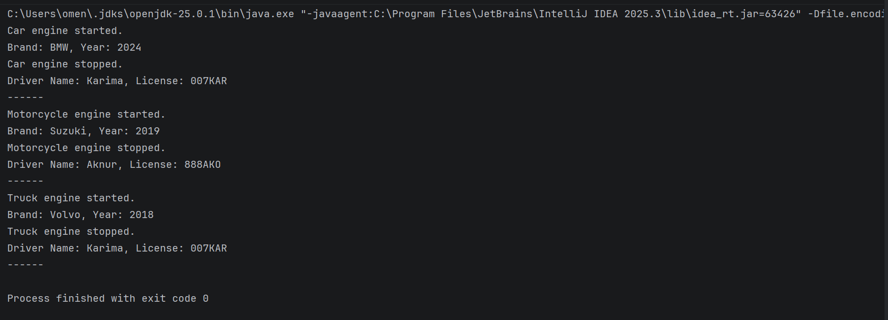
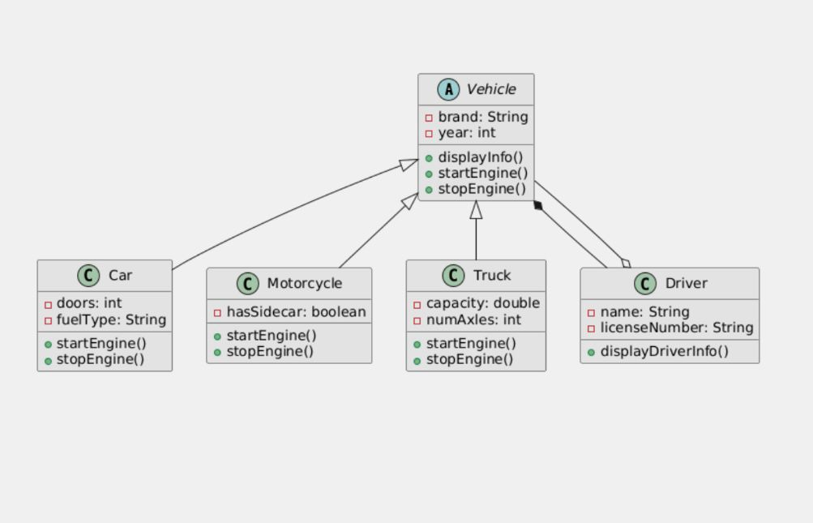

# assignment2-Karima

## Project Overview

The main goal of this assignment is to practice basic OOP concepts such as inheritance,
abstraction, method overriding, composition, and aggregation using Java.

In this project, a simple Vehicle Management System is implemented.
There is an abstract class Vehicle and several subclasses such as Car, Motorcycle,
and Truck. Each vehicle can have a driver, and the program demonstrates how different
vehicle types work together in one system.

---

## OOP Concepts Used

- *Inheritance*  
  Car, Motorcycle, and Truck inherit common fields and methods from the abstract
  class Vehicle.

- *Abstraction*  
  The Vehicle class is abstract and contains abstract methods that must be implemented
  by all subclasses.

- *Method Overriding*  
  Each vehicle type overrides the startEngine() and stopEngine() methods to provide
  its own behavior.

- *Composition and Aggregation*  
  Each vehicle has a Driver object, and one driver can be associated with multiple
  vehicles.

- *Polymorphism*  
  An array of Vehicle objects is used to store different types of vehicles.

---

## Class Hierarchy

### Vehicle (abstract class)
- Fields: brand, year
- Abstract methods:
  - startEngine()
  - stopEngine()
- Concrete method:
  - displayInfo()

### Car
- Extends Vehicle
- Additional fields: doors, fuelType
- Overrides engine methods

### Motorcycle
- Extends Vehicle
- Additional field: hasSidecar
- Overrides engine methods

### Truck
- Extends Vehicle
- Additional fields: capacity, numAxles
- Overrides engine methods

### Driver
- Fields: name, licenseNumber
- Method: displayDriverInfo()
- Used to demonstrate composition and aggregation

---

## How to Compile and Run
```bash
javac src/*.java
java Main
```

## Screenshots


They demonstrate:
- Correct engine start and stop behavior
- Display of vehicle information
- Display of driver information for each vehicle

---

## UML Class Diagram

Below is a class diagram for Vehicle Management System:



## Reflection

Inheritance simplified the project structure because all vehicles share common fields
and methods from the Vehicle class. This reduced code duplication and improved
readability.

Method overriding allowed each vehicle type to define its own behavior while keeping
a consistent interface. The main challenge was correctly using access modifiers
(private and protected) and constructor chaining with the super keyword.

---
